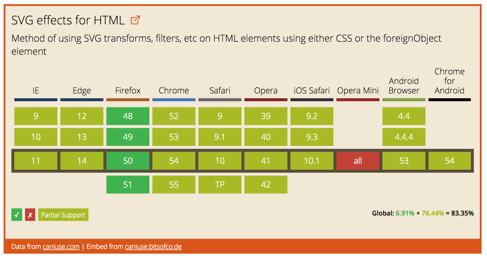
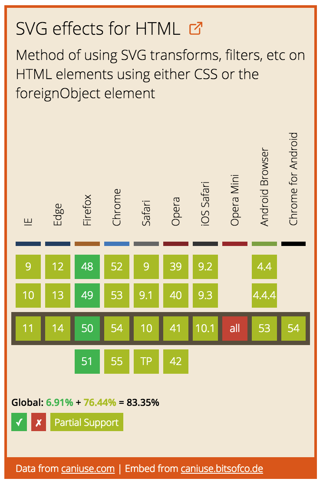

# `<caniuse-embed>`

`<caniuse-embed>` is a Polymer Element that displays feature support data from [caniuse.com](https://caniuse.com) for multiple versions of the 10 major browsers. It is configurable, reliable, and fully responsive. This Polymer element is based on the [original JavaScript embed](https://caniuse.bitsofco.de/).




## Installation

```
bower i ireade/caniuse-embed-polymer --save
```


## Usage

There are three properties you can add to the element for configuration -

Property | Description
---------|-------------
`feature` (required) | The feature slug, retrieved from caniuse.com
`futureVersions` | The number of future browser versions to display in the embed
`pastVersions` | The number of past browser versions to display in the embed


## Examples

**1. Create an embed for the "SVG Effects for HTML" feature, displaying one future version and two past browser versions**


<!--
```
<custom-element-demo>
  <template>
    <link rel="import" href="caniuse-embed.html">
    <link rel="import" href="../other-element/other-element.html">
    <next-code-block></next-code-block>
  </template>
</custom-element-demo>
```
-->
```html
<caniuse-embed feature="svg-html" futureVersions="1" pastVersions="2"></caniuse-embed>
```


**2. Create an embed for "Viewport Units" feature, displaying only the current browser version**

<!--
```
<custom-element-demo>
  <template>
    <link rel="import" href="caniuse-embed.html">
    <link rel="import" href="../other-element/other-element.html">
    <next-code-block></next-code-block>
  </template>
</custom-element-demo>
```
-->
```html
<caniuse-embed feature="viewport-units"></caniuse-embed>
```
